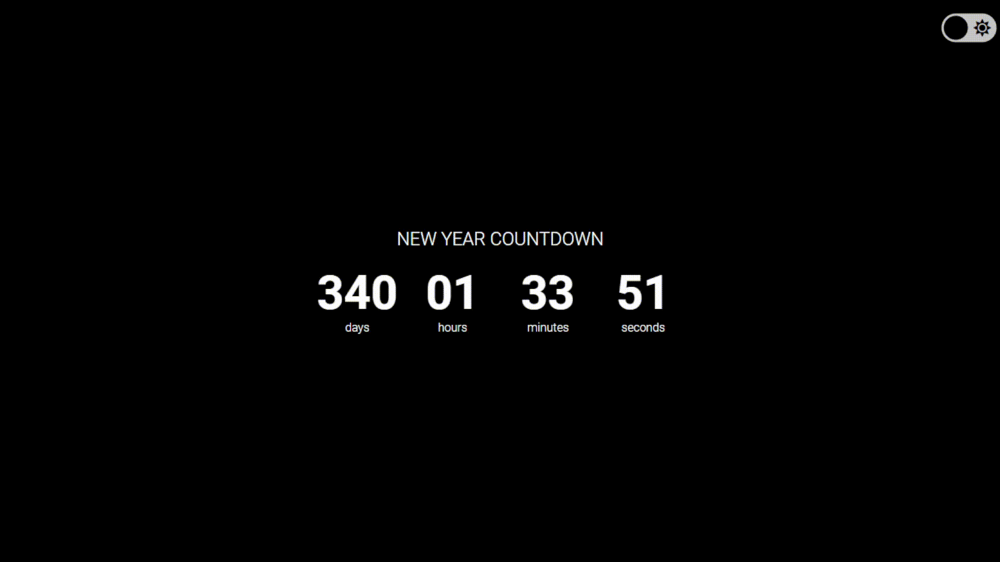

# #NewYearCountdown

Um  contador regressivo que obtem a data atual do computador e faz o calculo de quanto falta para o próximo ano! <br/>
Além disso, temos a opção de tema para claro e escuro, através de um botão localizado no topo da página.

## Demonstração


## Aprendizados

Neste projeto usei JavaScript para obter a data atual do computador, usei o método de instância getFullYear() do objeto Date. O método getFullYear() retorna o ano da data especificada no construtor de Date. O objeto Date contém um Number representado em milissegundos.

```javascript
const now = new Date()
const nextYear = now.getFullYear() + 1;
```

Depois de obter quanto tempo em milissegundos faltam da data atual até o próximo ano, já configurado para o dia 1º de janeiro:

```javascript
const targetDate = new Date(nextYear, 0, 1)
const timeLeft = targetDate - now;
```

E por último fazer os calculos para converter os milissegundos em dias, horas, minutes e segundos:

```javascript
const days = Math.floor(timeLeft / (1000 * 60 * 60 * 24));
const hours = Math.floor((timeLeft % (1000 * 60 * 60 * 24)) / (1000 * 60 * 60));
const minutes = Math.floor((timeLeft % (1000 * 60 * 60)) / (1000 * 60));
const seconds = Math.floor((timeLeft % (1000 * 60)) / 1000);
```

Outro aprendizado legal que tive foi fazer o switch de modo claro e escuro, algo que ja tinha pensado em fazer, mas ainda não tinha posto em prática!

## 🚀 Sobre mim
Olá, eu sou o Junior!

Sou graduando em Analise e Desenvolvimento de Sistemas pela Universidade Paulista (UNIP). Me especializando em frontend com HTML, CSS, JavaScript, TypeScript, React, NextJS e TailwindCSS que são as ferramentas que atualmente mais uso no meu cotidiano. Tenho experiência em desenvolvimento de sites responsivos buscando o melhor desempenho nos diferentes dispositivos.


## 🔗 Links

[](https://github.com/junior-leandro)
[](https://www.linkedin.com/junior-leandro)
[](https://instagram.com/jr_uba)
[](mailto:contato_jr@outlook.com)
[](https://junior.dev.br/)

## 🛠 Habilidades
Javascript, HTML, CSS...

